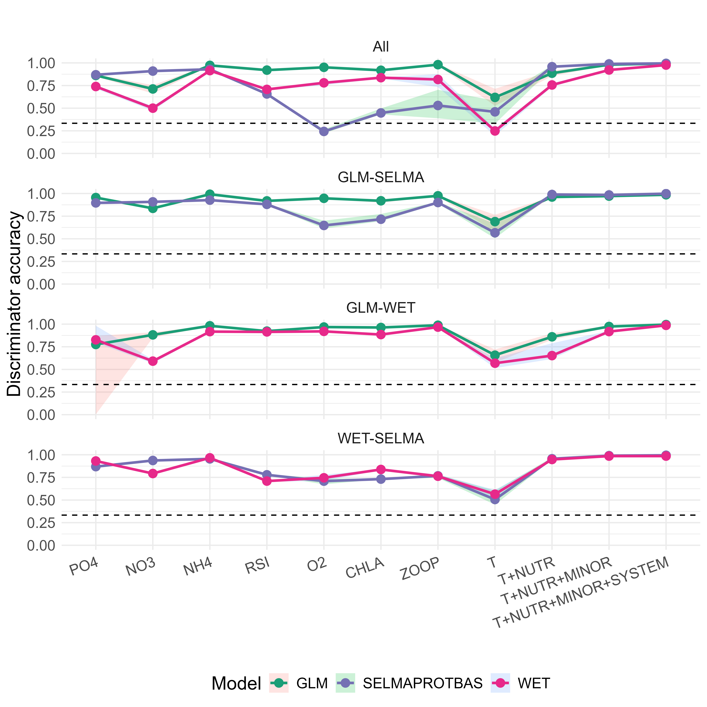

# Identification of individual models from an ensemble approach
A variational autoencoder framework is used to convert time series data of fluxes from an ensemble model approach into latent space. Then, a trained discriminator model checks if it's able to accurately classify latent space representation as model-specific data. 

A high accuracy highlights that the model can be distinguished from the others and indicates that it is mechanistically different. A low accuracy (at or below 33 %) highlights that the discriminator cannot distinguish the model well, meaning its latent representations overlap with other models. This indicated that the model is structurally very similar to the other models.

We check this across model combinations (all, specific pairs) and across ecosystem complexity (single states, combined states) and multiple iterations to average out the discriminator accuracy.

SELMAPROTBAS is easily identifiable for nutrients (PO4, NO3, NH4, reactive Silica), but has low accuracy for O2, Chla and Zooplankton, which are emergent system dynamics. On the other hand, GLM and WET behave similarly across the nutrients, but have a high accuracy for the emergent system dynamics of O2, Chla and Zooplankton. Looking at temperature, T, WET has a low accuracy, meaning it shares a latent space representation with another model. GLM has a high accuracy. As GLM is an integral energy model, it behaves mechanistically differently regarding vertical mixing compared to SELMAPROTBAS and WET, who are both k-Epsilon turbulence models. When adding more ecosystem metrics (nutrients like PO4 and NH4, minor nutrients lik NH4 and RSI, or system metrics like O2, Chla and Zoop), the models become better identifiable. This highlights that by using an ensemble of models, one gets mechanistically very different projections.